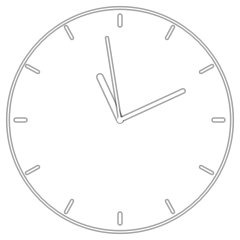

# Minimal Clock

A **minimal transparent analog clock** built with **PySide6 / Qt6**. A frameless,
borderless widget that draws thin hands directly with QPainter — no SVG assets or
heavy graphics toolkit required. The design is a rip-off Analog-Chronometer.



## Features

- Transparent, frameless, always-on-top window
- Smooth or tick-based hand animation (deactivatable to save CPU)
- **2 colors**: white and black, plus a semi-transparent white option
- Configurable radius (40–300 px)
- Per-clock **IANA timezone** support (e.g. `Europe/London`)
- **Up to 2 clocks** side by side
- **KWin / Wayland integration**: keeps window on all desktops and remembers
  position (via D-Bus)
- Settings saved to `~/.config/minimal-clock/config.json`

## Requirements

- Python 3.10+
- PySide6 (Qt6)

```bash
pip install -r requirements.txt   # installs pyside6
```

System packages for Qt6 may also be needed on some distros.

## Run

```bash
python3 minimal_clock.py
```

### Command line

```
python3 minimal_clock.py --help

  --config PATH       Config file path
  --radius N          Clock radius in pixels (40-300)
  --size N            Window size (alias for --radius)
  --color NAME        Hand color (white, black, semi-transparent)
  --keep-above        Keep window above others
  --no-smooth         Tick once per second (saves CPU)
  --timezone TZ       IANA timezone for the first clock (e.g. Europe/London)
```

### Multiple clocks

Up to 2 clocks can run in a single instance. Set timezones via the right-click
**Settings** panel, or at launch:

```bash
python3 minimal_clock.py --timezone Europe/London --keep-above
```

## Usage

- **Left-click + drag** — move the clock
- **Right-click** — Settings, Always on top, Quit

### Performance

With smooth animation the clock redraws every 100 ms. Disable it
(`--no-smooth`) to redraw every second, reducing CPU on slower hardware.

## Project structure

```
minimal_clock.py      Entry point + CLI
src/
  config.py           Config paths, constants, load/save JSON
  clock_widget.py     Clock drawing (QPainter) + window drag/menu
  manager.py          Window spawning, settings, KWin integration
  settings_window.py  Right-click settings panel
  kwin.py             KWin / Wayland D-Bus helpers
tools/
  verify_hands.py     Render-test: verify hand angles at a known time
  verify_live_config.py  Render-test: verify with live config
```
