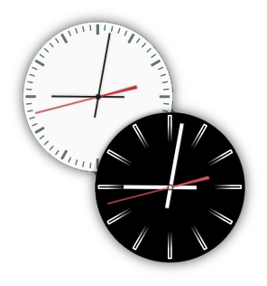

# Analog Clock Widget

A portable **GTK3 desktop clock widget** — a rewrite of the Cinnamon desklet
[`clock@schorschii`](https://github.com/linuxmint/cinnamon-spices-desklets)
that runs on **any Linux distribution** with Python 3 and GTK3, no Cinnamon
required.



## Features

- Analog clock with **smooth hands** (deactivatable for older hardware)
- **5 built-in themes**: Light, Dark, Light Transparent, Dark Transparent, Semitransparent
- **Custom images**: use your own background / hour / minute / second hand graphics
- **Custom timezone** (IANA names, e.g. `Europe/London`)
- **Custom label** above the clock (e.g. for multi-timezone setups)
- **Frameless widget mode**: drag it anywhere, right-click for settings
- **Multiple instances**: run several clocks with different styles/timezones
- Settings saved to `~/.config/clock-widget/config.json`

## Requirements

- Python 3
- PyGObject (`gi`) with GTK 3
- GdkPixbuf with SVG support

Install on your distro:

| Distro | Command |
|---|---|
| Ubuntu / Debian / Mint | `sudo apt install python3-gi gir1.2-gtk-3.0 gir1.2-gdkpixbuf-2.0` |
| Fedora | `sudo dnf install python3-gobject gtk3` |
| Arch / Manjaro | `sudo pacman -S python-gobject gtk3` |
| openSUSE | `sudo zypper install python3-gobject gtk3` |

## Run (no install)

```bash
python3 clock.py
```

## Install (optional, no root)

```bash
./install.sh            # installs to ~/.local/share/clock-widget + menu entry
./install.sh --no-menu  # skip the desktop menu entry
./install.sh --uninstall
```

After installing, launch from your application menu ("Analog Clock Widget") or:

```bash
~/.local/share/clock-widget/clock.py
```

To start at login, add that command to your desktop's "Startup Applications".

## Usage

- **Left-click + drag** — move the clock (only in frameless widget mode)
- **Right-click** — settings, always on top, lock position, quit

### Command line

```
python3 clock.py --help

  --size 300                 Clock size in pixels (10-500)
  --style dark               light | dark | light_transparent | dark_transparent |
                             semi_transparent | custom-images
  --show-seconds             Show the seconds hand
  --hide-seconds             Hide the seconds hand
  --no-smooth-seconds        Disable smooth seconds hand (saves CPU)
  --no-smooth-minutes        Disable smooth minutes hand
  --label "London"           Custom label above the clock
  --timezone Europe/London   IANA timezone
  --position 100 200         Initial window position
  --keep-above               Keep above other windows
  --frameless / --decorated  Widget mode vs. normal window
  --img-bg / --img-seconds / --img-minutes / --img-hours PATH
                             Custom images (with --style custom-images)
  --config PATH              Use a different config file
```

### Multiple clocks

Run several instances with different options, e.g.:

```bash
python3 clock.py --style dark --timezone Europe/London --label "London" --position 50 50
python3 clock.py --style light --timezone America/New_York --label "NYC" --position 400 50
```

## Performance notes

- The **smooth seconds hand** redraws every 100 ms. On older hardware, disable it
  (`--no-smooth-seconds` or Settings → Visual) to reduce CPU usage.
- When the seconds hand is hidden, the clock only redraws every 3 seconds.

## Project structure

```
clock.py                 Entry point + CLI
src/
  config.py              JSON config (~/.config/clock-widget/config.json)
  theme.py               Theme → image path resolution
  clock_widget.py        Clock drawing (Gtk.DrawingArea + cairo)
  clock_window.py        Widget window, drag, context menu, settings dialog
assets/
  img/<theme>/           SVG clock faces (bg, h, m, s) for each theme
  icon.png               App icon
install.sh               User-level installer (no root)
```

## Credits

- Original Cinnamon desklet code and themes by **schorschii**
- "Light transparent" and "Dark transparent" themes by **claudiux**
- GTK3/Python port by this project